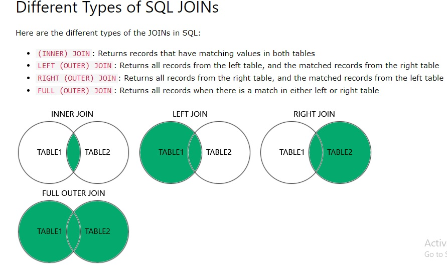
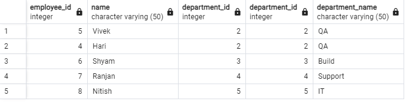
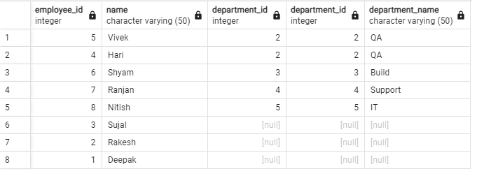
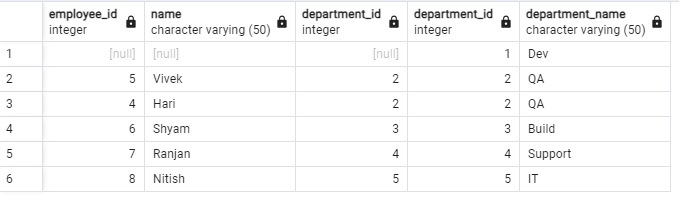
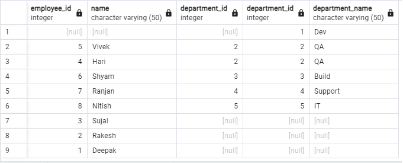
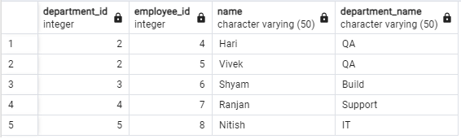
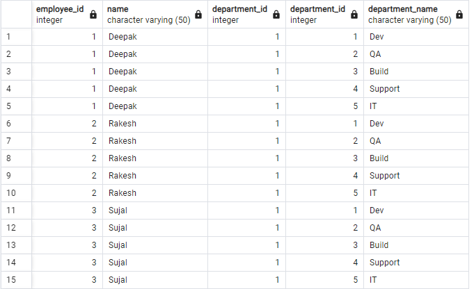
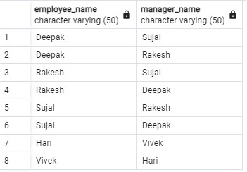

# <u>Data Definition Language (DDL):</u>

>DDL commands are used to define the structure and schema of the database.
They allow you to create, modify, and delete database table.

Common DDL commands include:
---

- `CREATE:` Used to create new database objects like tables, indexes, views, and schemas.

- `ALTER:` Used to modify(add, delete, or modify columns) the structure of existing database tables.

- `DROP:` Used to delete or remove existing database table.

- `TRUNCATE:` Used to remove all data from a table without deleting the table structure.

- `RENAME:` Used to rename an existing database table.

Example DDL commands:
---
`CREATE TABLE:` Creates a new table in the database.
```sql
CREATE TABLE Persons (
    PersonID int,
    FirstName varchar(255),
    Address varchar(255),
    City varchar(255)
);
```

`ALTER TABLE:` Modifies(add, delete, or modify columns) the structure of an existing table.

- ADD Column
```sql
alter table persons add column lastname varchar(255);
```

- DROP Column
```sql
alter table Persons drop column lastname;
```
- RENAME COLUMN
```sql
alter table Persons rename column FIRSTname to fname;
```
- ALTER/MODIFY DATATYPE of COLUMN
```sql
alter table persons alter money type float;
```
`Rename TABLE:` Used to rename an existing database table.
```sql
ALTER TABLE persons rename to person
```

`Drop Table:` Used to delete or remove existing database table.
```sql
drop table person
```

`Truncate Table:` Used to remove all data from a table without deleting the table structure.
```sql
truncate table person
```

# <u>Data Manipulation Language (DML):</u>
- DML commands are used to manipulate the data stored in the database.
   - They allow you to insert, update, and delete data from database tables.
   - Common DML commands include:
     - `INSERT`: Used to add new rows of data into a table.
     - `UPDATE`: Used to modify existing data in a table.
     - `DELETE`: Used to remove rows of data from a table.

   Example DML commands:   
   - `INSERT INTO table_name (column1, column2, ...) VALUES (value1, value2, ...)`: 
   ```sql
   insert into person(personid, fname) values(2, 'raja')
   /*another example*/
   insert into person(personid) values(3);
   /*another example*/
   insert into person values(4, 'raju');
   /*another example*/
   insert into person values(6, 'ramesh'),(7, 'john'),(8,'henry'); 
   ```
   - `UPDATE table_name SET column1=value1, column2=value2 WHERE condition`:
   ```sql
   update person set fname='deepak swami' where fname='deepak';
   ```
   - `DELETE FROM table_name WHERE condition`: 
   ```sql
   delete from person where fname='john';
   ```

# <u>JOINS IN SQL:</u>
## Types of Joins:
- **INNER JOIN**
- **LEFT JOIN (or LEFT OUTER JOIN)**
- **RIGHT JOIN (or RIGHT OUTER JOIN)**
- **FULL JOIN (or FULL OUTER JOIN)**
- **NATURAL JOIN**
- **CROSS JOIN**
- **SELF JOIN**
>NOTE: NATURAL JOIN, CROSS JOIN and SELF JOIN are added explicitly and not present in this image.  

>

### Tables query to perform practical:
```sql
CREATE TABLE Employee (
    employee_id INT,
    name VARCHAR(50),
    department_id INT
);

CREATE TABLE Department (
    department_id INT,
    department_name VARCHAR(50)
);

ALTER TABLE Employee
ADD CONSTRAINT PK_Employee PRIMARY KEY (employee_id);

ALTER TABLE Department
ADD CONSTRAINT PK_Department PRIMARY KEY (department_id);
/*Data to Test*/
insert into department values(1, 'Dev'),(2, 'QA'),(3, 'Build'),(4, 'Support'),(5, 'IT');
insert into employee values(1,'Deepak',1),(2,'Rakesh',1),(3,'Sujal',1),(4,'Hari',2),(5,'Vivek',2),
(6,'Shyam',3),(7,'Ranjan',4),(8,'Nitish',5);
```
>`NOTE:` FOR TESTING PURPOSE: I had set the value for department id where id='1' as null. Output for which you can see in below Joins Images. EXCLUDE SELF JOIN and CROSS JOIN from it. 

`INNER JOIN`: Returns rows that have matching values in both tables based on the join condition.
>
```sql
/*Syntax*/
SELECT * FROM table1 INNER JOIN table2 ON table1.column = table2.column;
/*Examples*/
SELECT * 
FROM Employee INNER JOIN department ON Employee.department_id = department.department_id;

SELECT employee.employee_id, department.department_id, employee.name, department.department_name 
FROM Employee INNER JOIN department ON Employee.department_id = department.department_id;

SELECT employee.employee_id, department.department_id, employee.name, department.department_name 
FROM Employee INNER JOIN department ON Employee.department_id = department.department_id WHERE department.department_name = 'IT';
/*Alias*/
SELECT e.employee_id, e.name, d.department_name
FROM employee e
INNER JOIN department d ON e.department_id = d.department_id
WHERE d.department_name = 'IT';
```

`LEFT JOIN (or LEFT OUTER JOIN)`: Returns all rows from the left table and the matched rows from the right table. If there is no match, the result contains NULL in the columns from the right table.
>
```sql
/*Syntax*/
SELECT * FROM table1 LEFT JOIN table2 ON table1.column = table2.column;
/*Example*/
Select * from employee Left join department on employee.department_id=department.department_id
```
`RIGHT JOIN (or RIGHT OUTER JOIN)`: Returns all rows from the right table and the matched rows from the left table. If there is no match, the result contains NULL in the columns from the left table.
>
```sql
/*Syntax*/
SELECT * FROM table1 RIGHT JOIN table2 ON table1.column = table2.column;
/*Example*/
select * from employee right join department on employee.department_id = department.department_id
```

`FULL JOIN (or FULL OUTER JOIN)`: 
>It is addition of Left and Right Join.

Returns all rows from both tables, matching records from both sides where available. If there is no match, the result contains NULL in the columns from the other table.
>
```sql
/*Syntax*/
SELECT * FROM table1 FULL JOIN table2 ON table1.column = table2.column;
/*Example*/
Select * from employee Full Join department on employee.department_id=department.department_id
```

`NATURAL JOIN`: is a type of join that automatically matches columns with the same names in the two tables being joined. It eliminates the need for specifying the columns to join on explicitly, as it identifies the matching columns based on their names.
>
```sql
/*Syntax*/
SELECT * FROM table1 NATURAL JOIN table2;
/*Example*/
SELECT * FROM employee NATURAL JOIN department;
```

`CROSS JOIN`: Returns the Cartesian product of the two tables, meaning each row from the first table is combined with every row from the second table.
>`NOTE`: Below image is not complete but it depicts that every employee from Employee table is with every department in Department table.
>
```sql
/*Syntax*/
SELECT * FROM table1 CROSS JOIN table2;
/*Example*/
SELECT * FROM Employee CROSS JOIN Department;
```

`SELF JOIN`: Joins a table to itself, typically used when comparing rows within the same table.
>
```sql
/*Example*/
SELECT e1.name AS employee_name, e2.name AS manager_name FROM Employee e1 JOIN Employee e2 
ON e1.department_id = e2.department_id AND e1.employee_id <> e2.employee_id;
